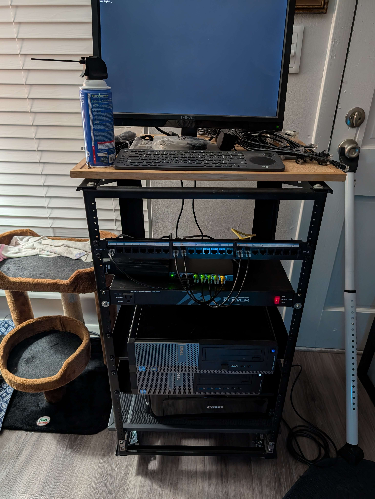

# March 30th, 2025

Not a ton of new for this week, just steady progress and setting up the lab.

I got a patch panel to clean up the cables.

I am beginning to realize that getting the new switch might start to become a priority faster than I thought as I realize that I only have 3 open ports left.  One will be the new router, one will be an poe camera, and the last will end up being a third server (for hosting Minecraft other other type servers for my friends).  That a future problem to figure out though.

Otherwise I mostly just kept working on setting up the services that will run on the NAS.

- Switched from the external hdd to an internal ssd (will change to a RAID setup eventually)
- Reconfigured the shares, and music server to use the new ssd location.
- downloaded my entire archive from the cloud on to the nas.
- reorganized some of the files to set up home directories for each of the users on the file share
- added a dns server to set a custom intranet domain name for each of the systems on the network, along with a dns sink for ad/malware.
- Continued to update the docs.

Other than that I cleared the new extreme for ff14, and have got my gear set up to prog the new savage tier next week.