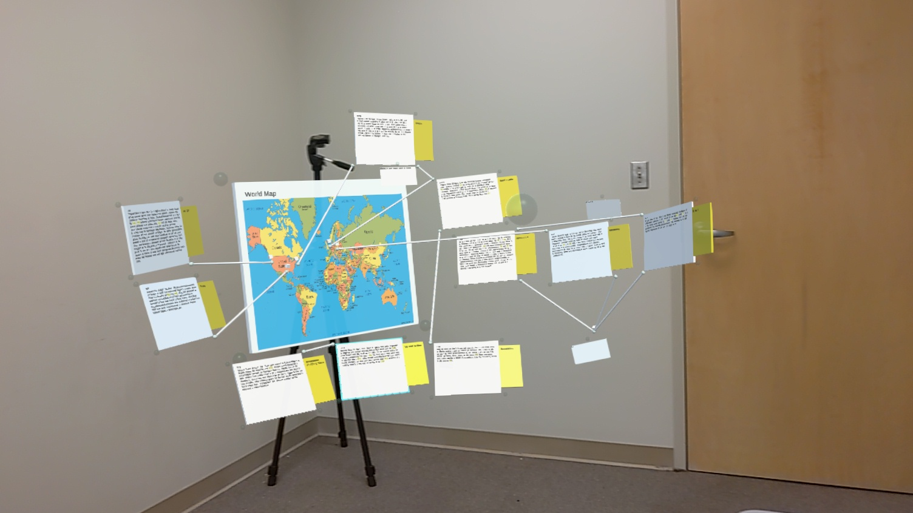

# AR Bulletin Board

This was my core project for my master's thesis.  It is an spatial sensemaking tool that uses the Hololens2 for AR, and a android phone as a spatial controller.  The core design goal was using a mobile device to supplement the low dexterity issues that current AR hand gestures struggle with.  Documents can be freely moved between the mobile device and AR.  If the user wants to highlight text, the user transfers it to the phone, highlights the text, then sends it back to AR.

The mobile device is also used menus and a keyboard for interactions.  Documents can be selected by tapping them with the phone and then moved as a group, sorted, organized into a grid, and other functions.  The mobile device can be used to select documents based on search terms.

The HoloLens app was made in unity and C#.  The mobile app is also made in unity.  The communication server for coordinating actions between the HoloLens and the mobile device is made in python using the tcp socket library. 

To evaluate the benefits of using this hybrid tool verse only AR I designed a user study. I created a version of ARBB that used an AR menus and gestures to replace the functionality provided by the mobile device. I carried out the user study, teaching the participants how to use AR, and how to use the tool.  I had 20 participants in total (10 for ARBB, 10 for AR only).

The results show that there was significantly faster completion times for tasks using the Hybrid ARBB tool, and users were more likely to experiment with organizations as the hybrid tool was more forgiving.  We also got valuable user feed back on what made the tool better than the AR only version, and what the main short comings of ARBB were.

(Will add link to full thesis when it becomes available. )

Collect document:

Highlight text:

Send document:

