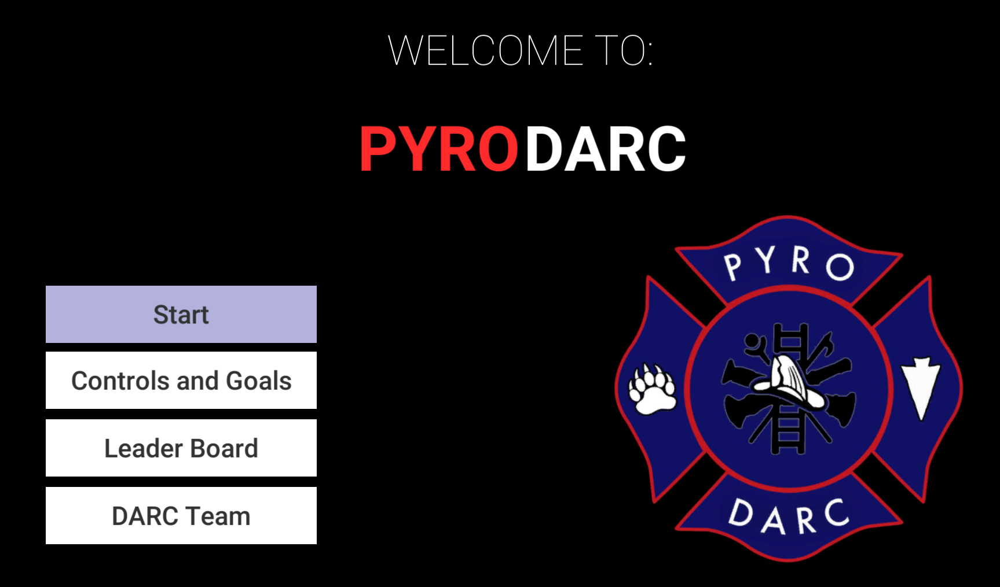
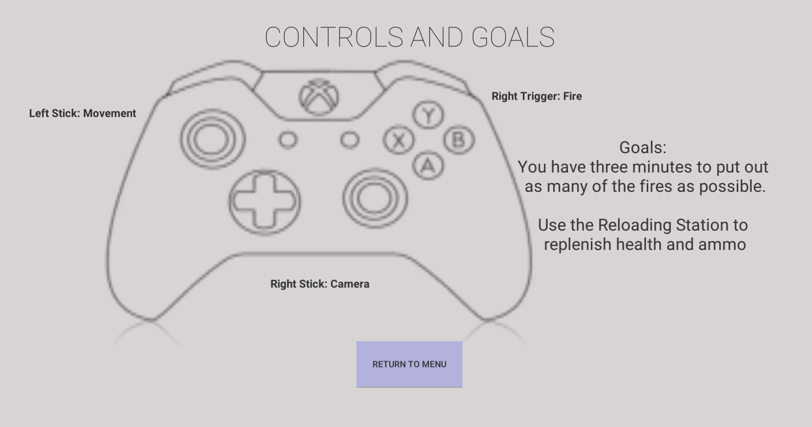
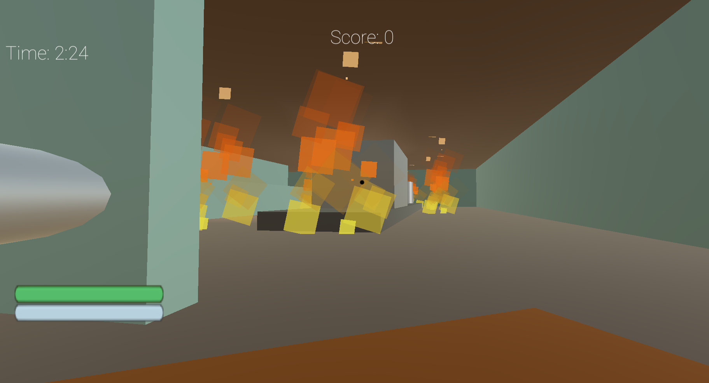

DARC is the robots team that I was on in high school in 2016-2017.  I was a programmer for the robot the first year.  We used C and an Arduino.  The second year I made a game in unity that was part of the marketing booth, and helped advise programming for the robot.  The team competed each year at [South's BEST](https://www.southsbest.org/index.html)

Both years I was one of our drivers for the competition and was at the workshop at least 3 days a week to work on the programming, help out with the building, or practicing the driving.  

I helped with the prototyping and brainstorming of the designing and game plan for scorning the most points with the given game rules.  The second years game needed a robot to shoot ping pong balls at stacks of cups to knock them down.  I came out with the initial mechanism for that, a wheel that could pull back a door spring each time it when around and then use the spring to flick a ball, and spent a lot of time helping fine tune and come up with solutions to increase consistency.  

Both years our robot and drivers scored 1st at South's BEST competition for the south east US, and our marketing team won 2nd. https://www.southsbest.org/results.html

## Marketing Booth game

The player controls a robot in first person and moves around a building putting out fires.

