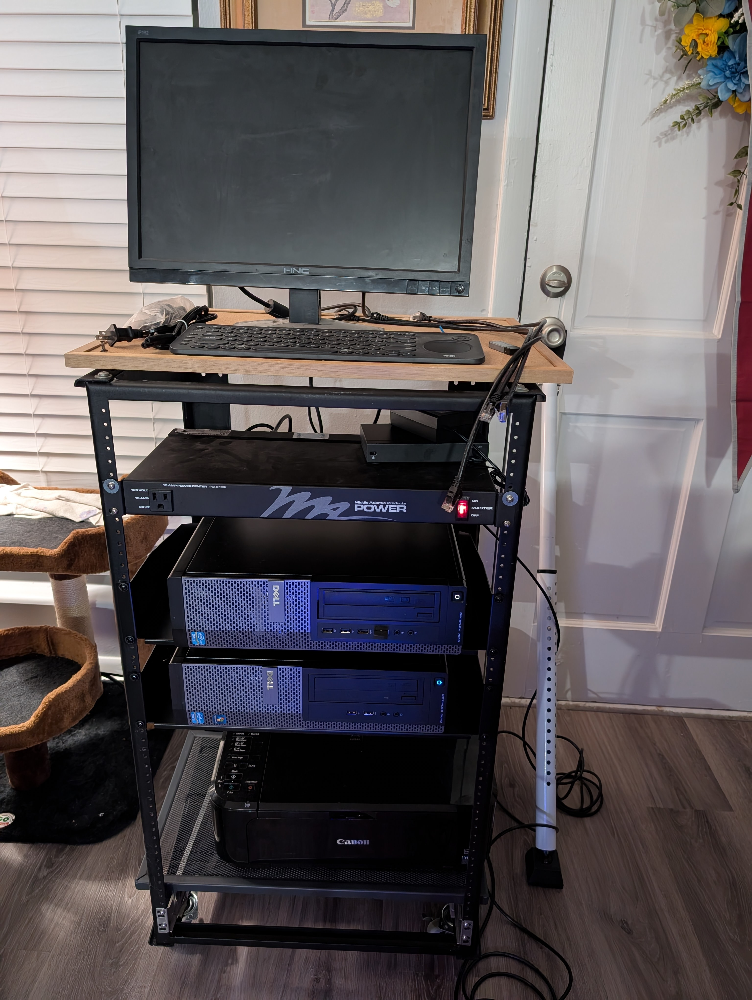

# DK Lab

This is my home lab.

It pretty simple for now.  I will add updates here as it grows.

## April 2025

I got a patch panel to start cleaning up some of the cables.

I got more services running on it:

- Navidrome
- DNS server with ad/malware sink
- Samba file share (still need to debug some issues with windows connecting to a few of the shares)

Working on next:

- Adding home assistant to manage IoT
- Get a 1U server to set up as a router/firewall (might move dns server to this too)
- Add VPN so I can access file share from outside the network
- Add video streaming/media playing
- Remote/cloud backup (setting up a raspberry pi velcroed to a external hdd.  once set up will have my brother run it at his place)
- Set up the dev server with git/gitlab
- Clean up documentation and localhost them as md book.

#### Rack layout

- 01\# NULL
- 02\# NULL
- 03\# ═ Patch Panel
- 04\# ═ Switch
- 05\# ═ NULL
- 06\# ═ Power Strip (1F + 8B)
- 07\# NULL
- 08\# NULL
- 09\# ╔ NAS
- 10\# ╚ Shelf
- 11\# NULL
- 12\# NULL
- 13\# ╔ Dev
- 14\# ╚ Shelf 2
- 15\# NULL
- 16\# NULL
- 17\# NULL
- 18\# NULL
- 19\# NULL

## March 2025

Its mostly parts I got from a local liquidation sale.  I added some casters to the rack so I could roll it around.

- 19U 18" depth rack
	- NULL
	- ⎨ Switch
	- ⎨ Power strip
	- NULL
	- NULL
	- ⎧ Shelf (Dev Server)
	- ⎩ ...
	- NULL
	- ⎧ Shelf (NAS/Docker)
	- ⎩ ...
	- NULL
	- NULL
	- NULL
	- NULL
	- NULL
	- NULL
	- NULL
	- NULL
	- NULL

Both running NixOS.

The Dev server is for a remote VS Code project environment.

The NAS is mostly just testing right now, but is running a few small samba shares, and a navidrome music server.