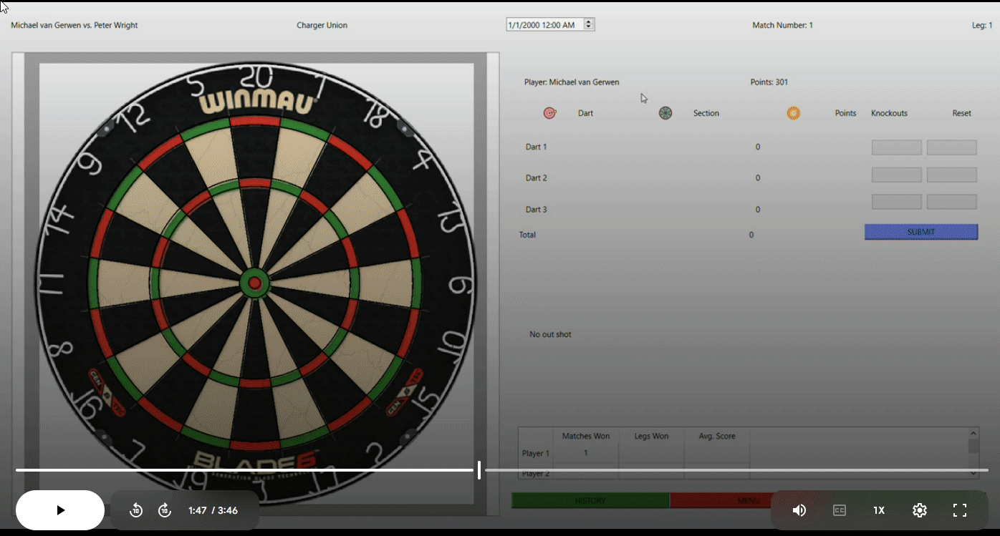

# Dart Game Recorder

This was my senior design project for my bachelor's degree.  It was a team project.  I ended up taking over as team leader and taught the group how to use git.

The project was made in C++ using Qt for the UI.  I don't remember too much of the actual implementation but I remember that the dart board had to be a special custom Qt widget that took a while to research how to make.  We finally found a way to make a custom widget that could be resized and could translate mouse clicks to local coordinates of the widget.  I made the algorithm to convers the x, y position of the mouse into which segment of the dartboard was clicked.  

I was mainly working on the back end and made all the classes and data structures that store players data and game logs.

Also competitive dart games are wild to watch.