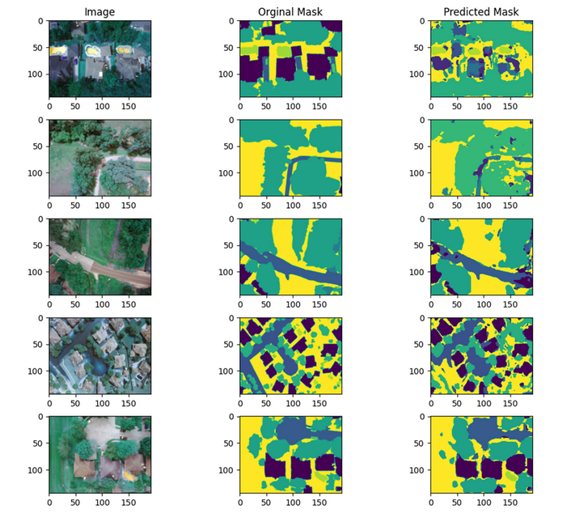
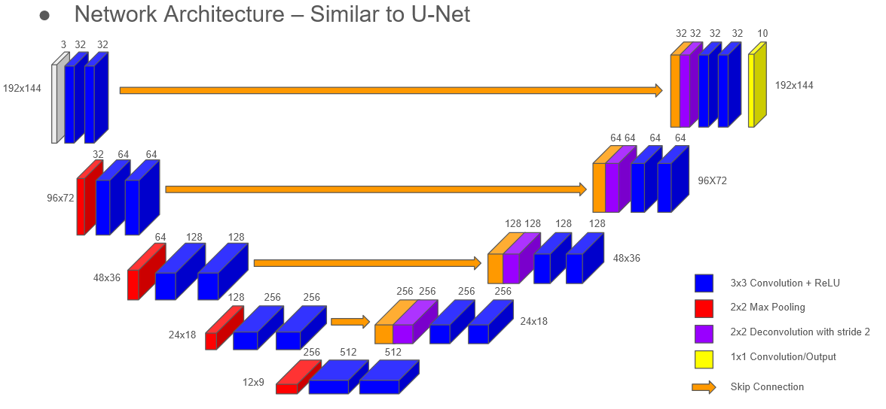
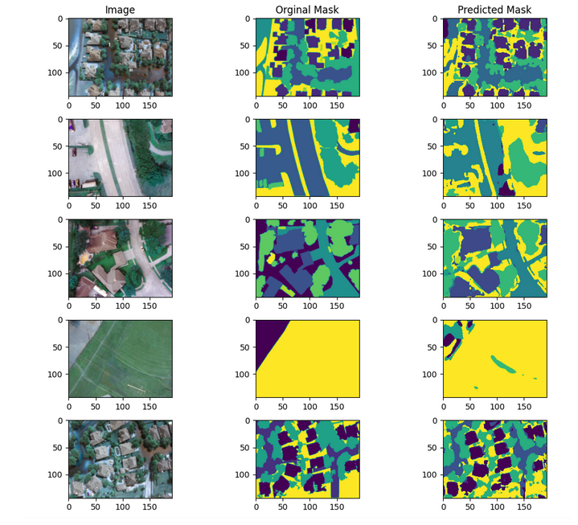

# FloodNet

This my final project for my deep learning class that I worked on with another student.  We were tasked with recreating the results of the FloodNet full convolution network.  We where given a set of images, and the ground truth pixel by pixel classification.

An example of our results:

Diagram of our net work design:

Loss and Accuracy over training time:

More example of the results:

