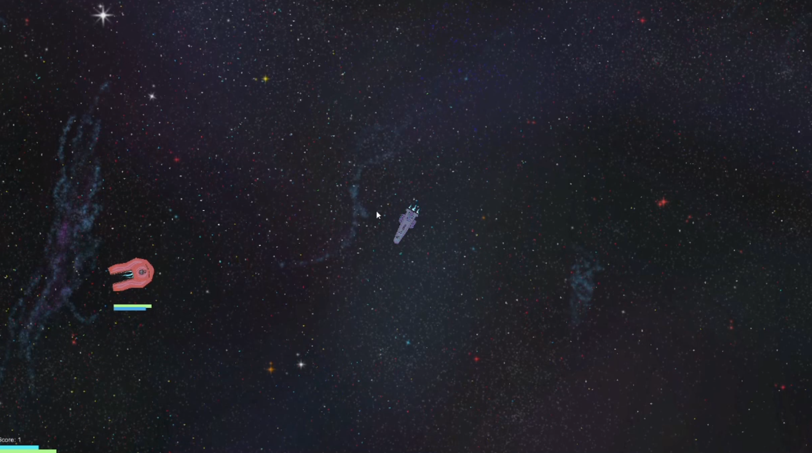

# Game Design Final

This was made for my game design final.  It is a simple space ship combat game.  The space ships have momentum and no friction.  The enemy uses the physics based seeking algorithm from my survey of artificial intelligence class.  Each ship has shields that recharge, and health that does not.  I pained the star background my self and made scripts that load in a grid of nine of the each image and as the player reaches the edge of the image they are in it moves copies over so that the map is "infinite".  Their is parallax between the layers so the the background barely moves at all, the stars slightly move, and the dust moves pretty quickly to show the actual current speed of the ships.