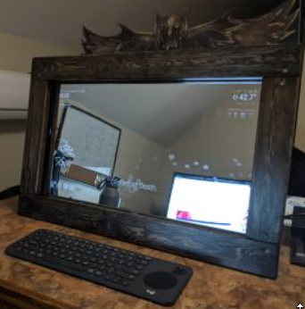
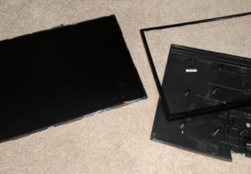
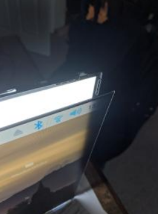
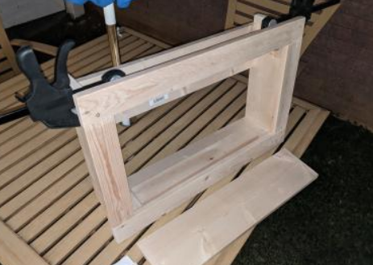
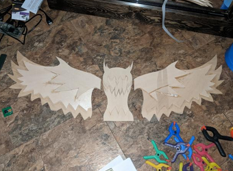
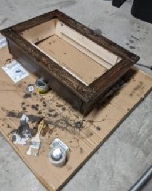

# Magic Mirror

This was my project for a rapid prototyping class.  Its a magic mirror made up of a one-way mirror, a monitor, a raspberry pi, and an IR touch frame.  It ran the [Magic Mirror 2](https://magicmirror.builders/).

I made a wood frame for it all and made an owl to top it off.  

I plan to revisit this one too as I work on my DK App, and I want to try and integrate that into the mirror.

