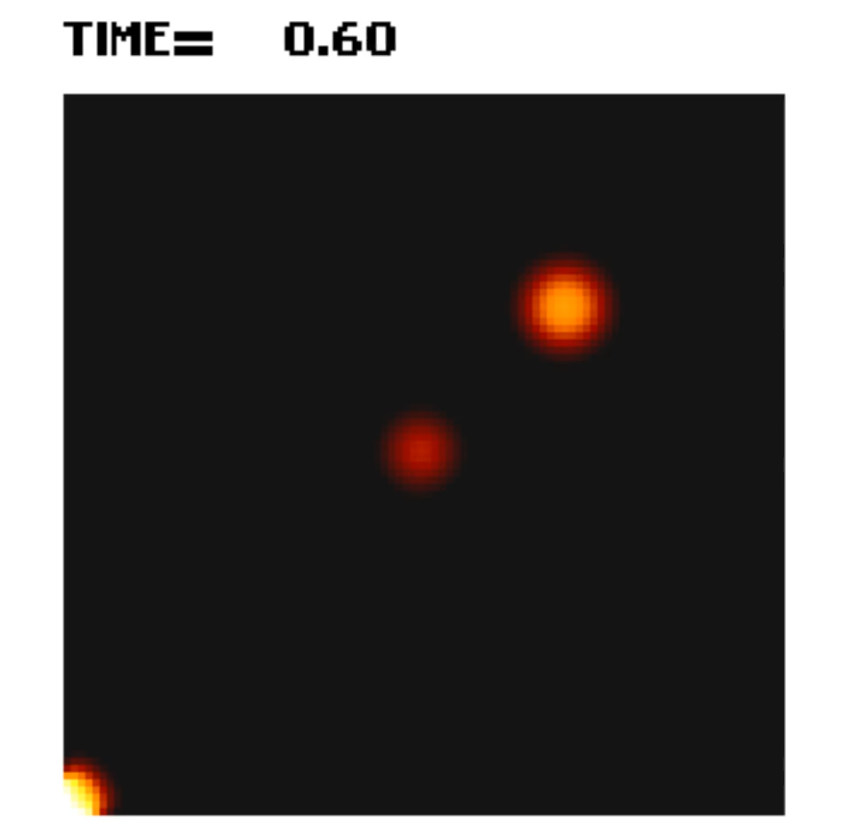

# Misc. Simulation and Modeling

I took two semesters of Simulation and Modeling during my masters degree and they where some of my favorite classes.  I did many projects for them.

One semester was focused on discrete event simulation.  We had to make our own library of function for generate random numbers for various types of distributions, and create our systems for ques, tellers, and event que.  We used these to for a variant of projects including: Airport checking lines, dump truck loading, transporting, and dumping material, and a super computer receiving, scheduling, and processing requests.

These ones didn't really have any nice pictures, and they just output logs of each event and averages.

The other semester was more varied and covers a variety of simulation topics.  This was also when I was working on my C image library so I got to use that to generate  visuals for the simulations outputs.  The two here are a sheep and wolf sim, an example of agent base simulation, and a heat transfer sim, an example of math models based sim.

