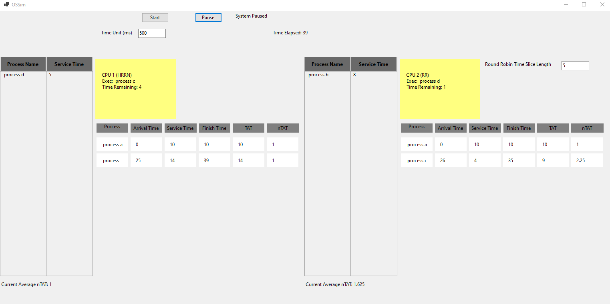

# OS Sim

[GitHub](https://github.com/Kaden-Ven-Gryphon/school-projects)

This was  group project for my OS class.  We had to make a simulator to compare different methods of time sharing for multiprocessing. 

There would a json file that lists a set of processes, their arrival time, and cycles to complete.  The CPU would keep a record of processes and swap them out using round robin, fifo, hrrn, and more.

Our team used the .NET frame work and C# for it.  Our team leader made some integrated tests for us and would run the test and do a code review with us before our part of the project could be merged into the main branch.

We used an agile like development cycle, each team member had a feature to implement for the week and at the end of the week would all do our code reviews, merge it all together, run tests, then decide who would work on what next.