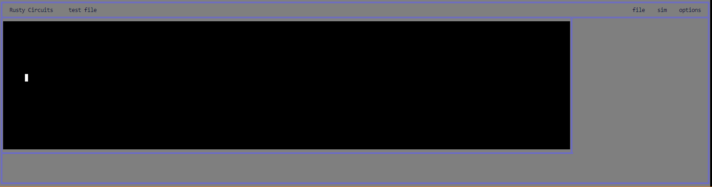
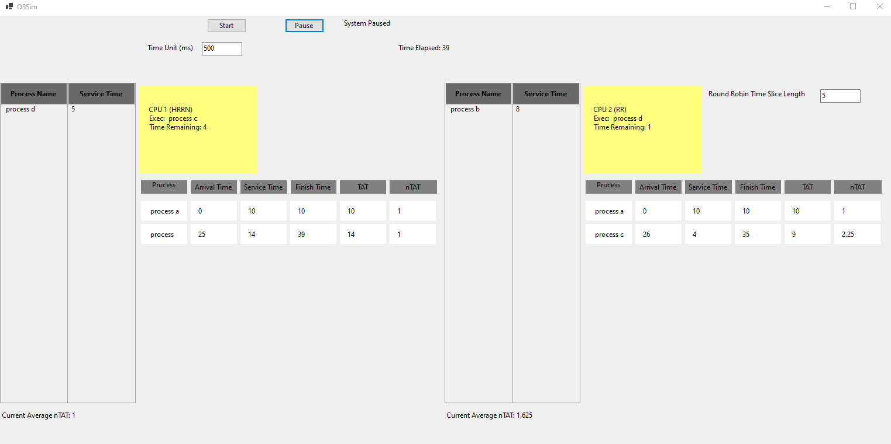
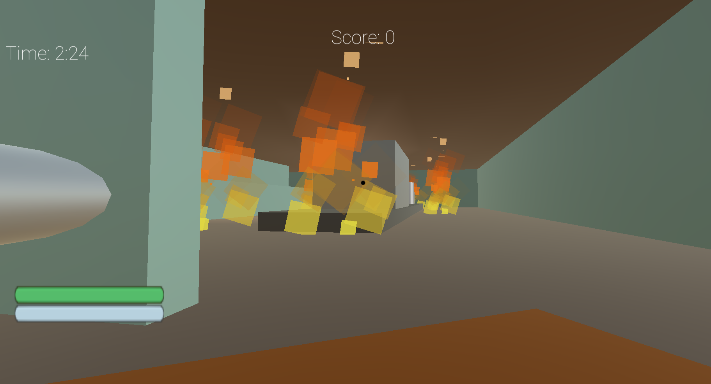
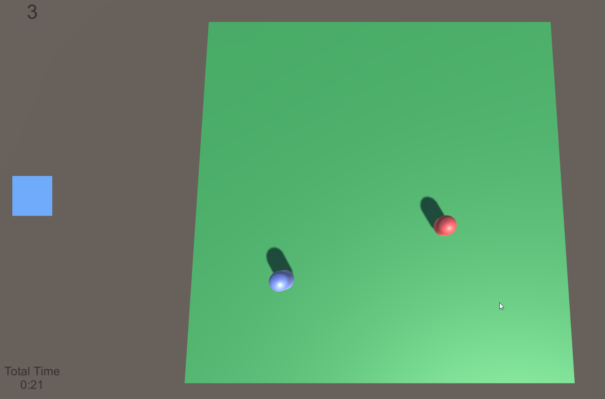

# Projects

I have a wide variety of projects using a many different programing languages.

- [DK Lab (Linux System Administration)](./DK_Lab.md)

	

- [Rusty Circuits 2025-WIP (Rust)](./rustycircuits.md)

	

- [kgemu 2025-WIP (rust)](./kgemu.md)
- [DK APP 2025-WIP (Python FastAPI, WIP)](./DK_APP.md)
- [Logic Gates Sim 2022-2024 (C)](./Logic_Gates_Sim.md)

	

- [AR Bulletin Board 2022-2024 (Unity C#, Python)](./ARBB.md)

	

- [FloodNet 2024 (Pytorch)](./Floodnet.md)

	

- [Assembly Academy 2022-2023 (Unity C#, ARM)](./Assembly_Acadamy.md)

	

- [Misc. Simulation and Modeling 2022-2023 (C)](./Misc%20Simulation%20and%20Modeling.md)

	
	

- [Guitar AR 2022 (Python)](./guitar.md)

	

- [Game Design Final](./GameDesignFinal.md)

	

- [Darts 2022 (C++)](./Darts.md)

	

- [Misc. OpenGL 2021 (C++, OpenGL)](./OpenGL_Misc.md)

	

- [OS Sim 2020 (C#, .NET)](./OSSIM.md)

	

- [Magic Mirror 2020 (Raspberry Pi)](./Magic%20Mirror.md)

	

- [DARC 2017-2018 (Arduino C, Unity C#)](./DARC.md)

	

- [Timed Tag Highschool Project (Unity C#)](./timedtag.md)

	