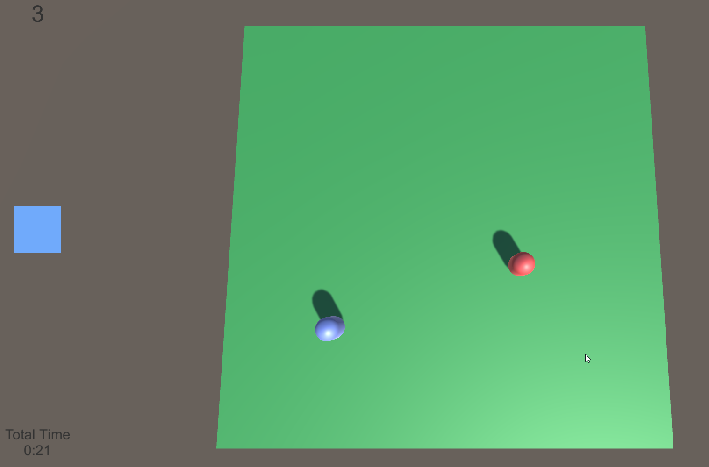

# Timed Tag

This is a simple game I made for the AP computer science class.

One player used WASD the other used the arrow keys.  The player who is "it" changed every 5 seconds, and they have to tag the other player to get points.  Because who is it changes you have to quickly be able to swap from chasing to running.  Inspired by PI tag mobile game.

